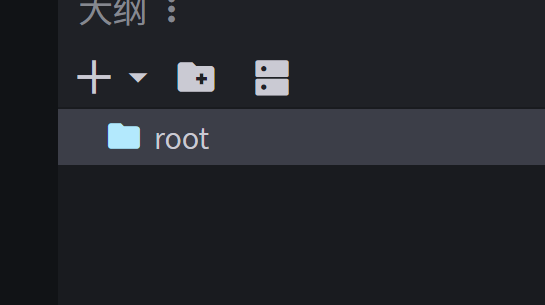
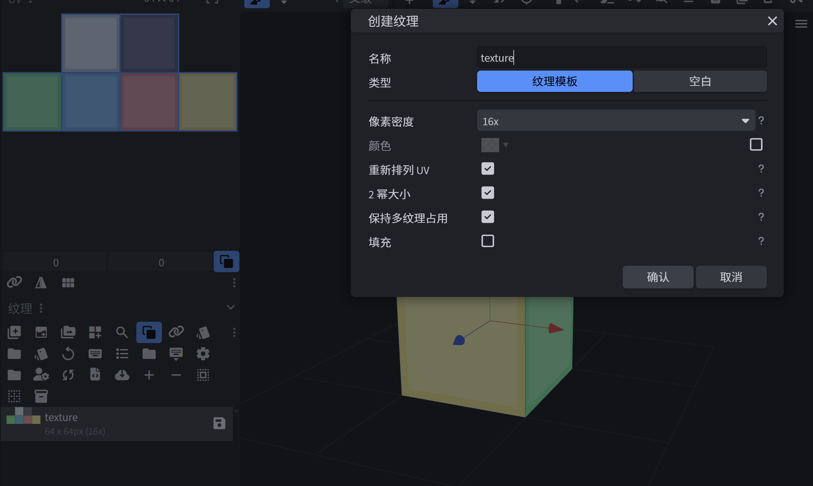
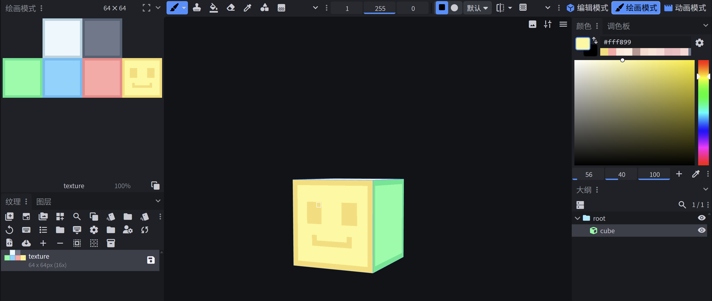

# Blockbench 建模 4D 皮肤

本文主要讲如何使用 Blockbench 建模 4D 皮肤。

## 1. 新建项目

首先打开 Blockbench，新建模型，选择 Bedrock 版实体模型，UV 模式选择箱型 UV。

文件，转换项目，选择 Bedrock 版旧版实体。

## 2. 创建骨骼

这里创建一个 bone，点击添加分组，把名字改为 root。

## 3. 创建纹理

然后创建一个块，点击创建纹理选项默认点击确定即可创建纹理。

## 4. 绘制纹理

点击纹理绘制，然后绘制图案。

## 注意事项

- 基础的 4D 皮肤只能是箱型 UV
- 且创建的 bone 如果是自定义命名的，必须要在 geometry.json 的倒数第二个大括号后面添加一个英文逗号 ","

## 5. 导出模型

点击文件 → 导出 → 导出 Bedrock 版实体，并把文件名字改为 geometry.json，同时导出纹理文件。

这样你的 4D 皮肤就制作完成了。

好了，你已经学会了制作 4D 的基础了。
因为4d皮肤建模实在是太坐牢了 我也不太会建模，所以就省去建模过程了