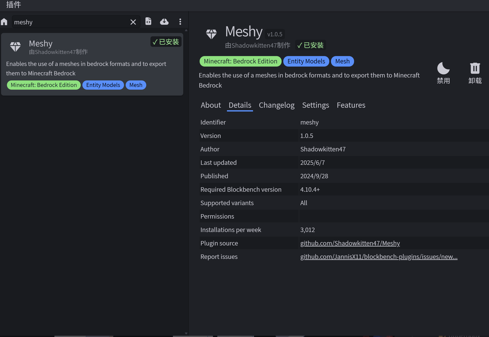
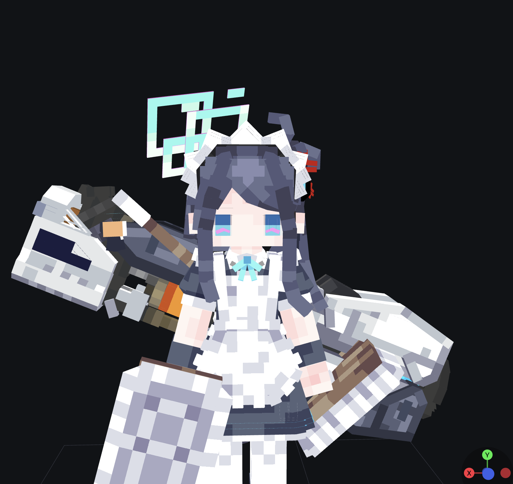

# YSM 移植工具介绍

好了学完了 4D 皮肤基础教程之后我们就开始学 YSM 或者是新版基岩模型的移植了。

## 准备工具与插件

### 1. UV 优化插件

（也是感谢网易开源了）

https://github.com/MCNeteaseDevs/UV-Optimizer

这里可以帮你充分利用与优化 UV，可以让你的贴图利用率充分提高。

**安装方法**：下载插件，找到文件 → 插件 → 从文件中加载插件，即可安装。

具体使用方法在 GitHub 仓库中都有介绍。

**注意事项**：
- 此插件本来是给开发者搞优化用的，但是在移植 4D 中有奇效，所以建议在移植 4D 模型时使用此插件
- 一定一定要在基岩模型中使用，千万别转换成自由模型
- 模型必须是逐面 UV
- 如果遇到箱型 UV，可以全选模型，右键 → UV 模式 → 找到逐面 UV

### 2. Meshy 插件

Meshy 插件主要是让你在基岩模型编辑模式下也可以看到、编辑，或者说导入带有网格元素的模型。

**下载方式**：在插件中找到可用，然后找到 Meshy 即可安装。

### 3. UV 修复工具

一些 YSM 作者在制作模型时，为了上色可能会选择箱型 UV，然后再在纹理区域厚涂处理。但是这对 YSM 模型的移植是一个问题，因为优化 UV 压缩贴图的时候会导致 UV 错乱，会出现如下的情况：

我就 vibe coding 了这个工具，可用帮助用户修复 UV 错乱问题。

**使用方法**：
1. 必须要确保模型是都转换成了逐面 UV，且把模型导出为 JSON 模型
2. 打开 [uvfixer](https://fangkuaichaoge.github.io/uvfixer/){target="_blank"} 工具
3. 上传文件，然后点击开始修复
4. 下载修复好的 JSON 模型就可以继续优化移植了

4 skinstudio
可以帮你把obj模型转换成json模型，并打包成皮肤包
工具链接https://mrarm.io/skinstudio/

本人fork的skinstudio
https://fangkuaichaoge.github.io/skinstudio/
这个功能更多，下文会详细介绍