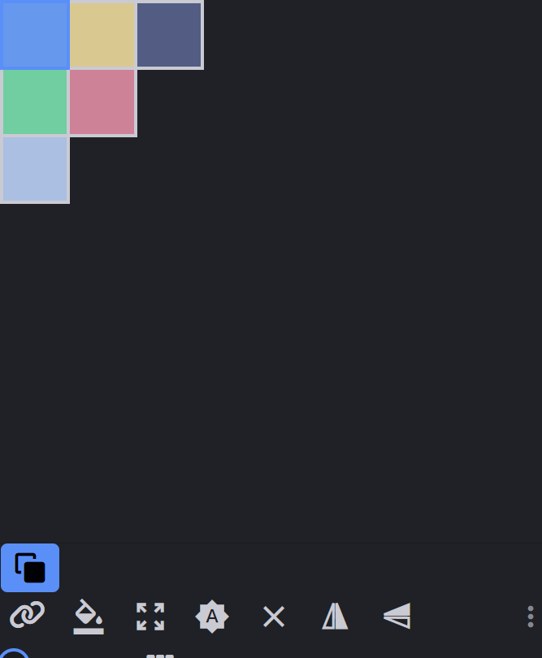
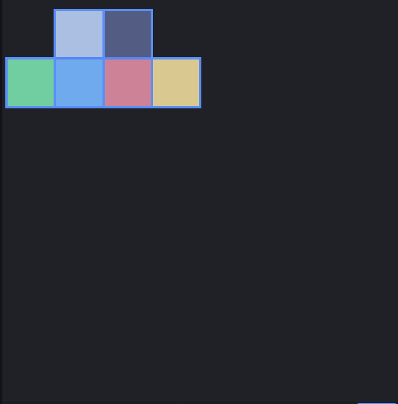

# 认识 UV

在开始学习移植之前，我们先认识一下 Blockbench 里的 UV。

## 逐面 UV

允许为立方体的每个面单独设置 UV 坐标，适合需要精细控制纹理映射的情况。

## 箱型 UV

将立方体视为一个整体进行 UV 展开，适用于简单的纹理映射需求。

可以注意到箱型 UV 区域有蓝色描边。

**注意**：箱型 UV 可以转成逐面 UV，但是一般情况下排列过 UV 之后的逐面 UV 模型很难转成箱型 UV，除非这个模型非常标准。所以一般情况下真的不建议在移植工作中接触箱型 UV 的 UV 优化工作，都是转成逐面之后再进行 UV 优化。

## 常见的 UV 优化方法

### 方法一：创建纹理法

创建纹理，把像素密度调到 16x（或者是适合的像素密度），然后创建纹理。

- **优点**：适合大部分模型
- **缺点**：会导致模型的纹理质量下降，并且利用率不高

### 方法二：插件法

使用网易给开发者开发的插件进行优化。

- **优点**：非常完美，几乎没有缺点
- **缺点**：一经优化，不能回退，而且不支持箱型 UV（可以转一下逐面），且不支持携带网格元素的模型