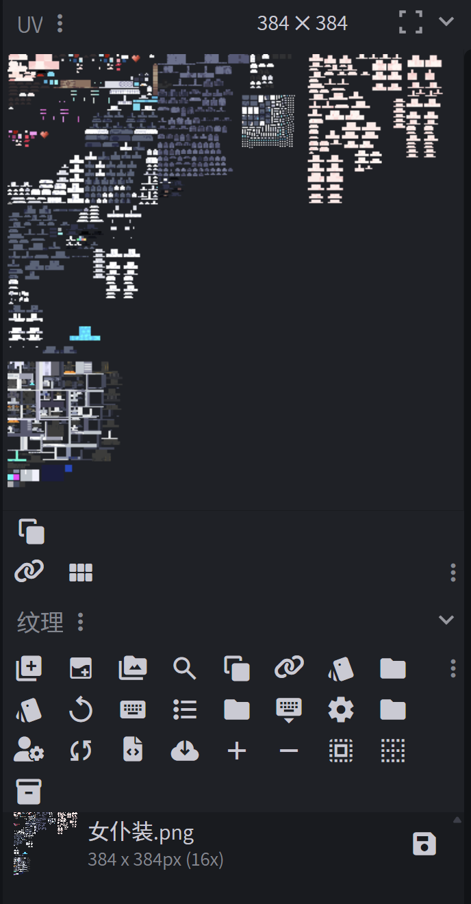
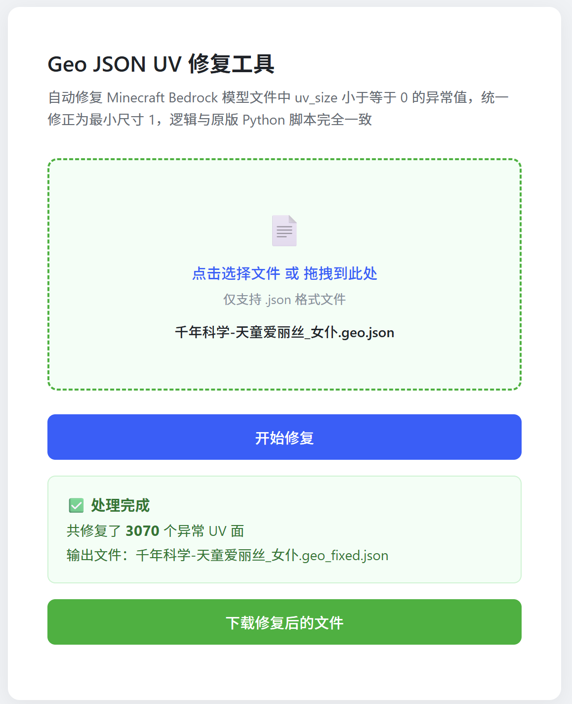
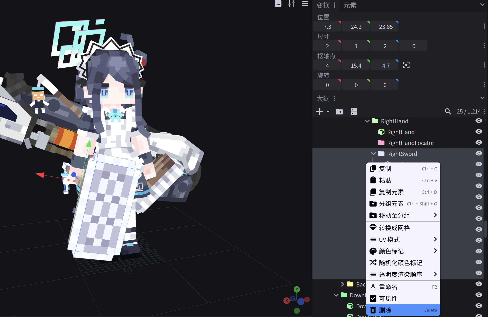
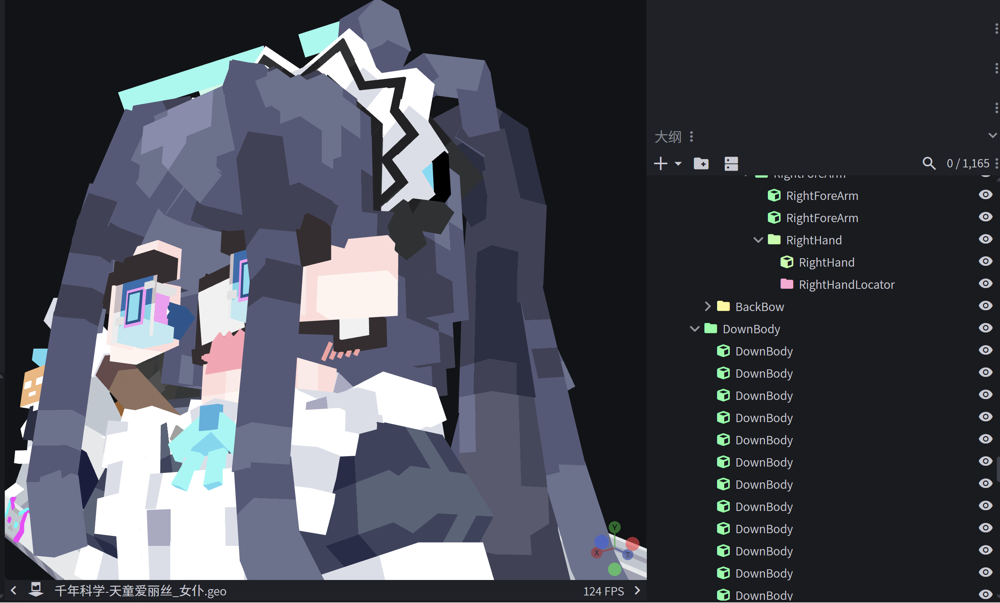
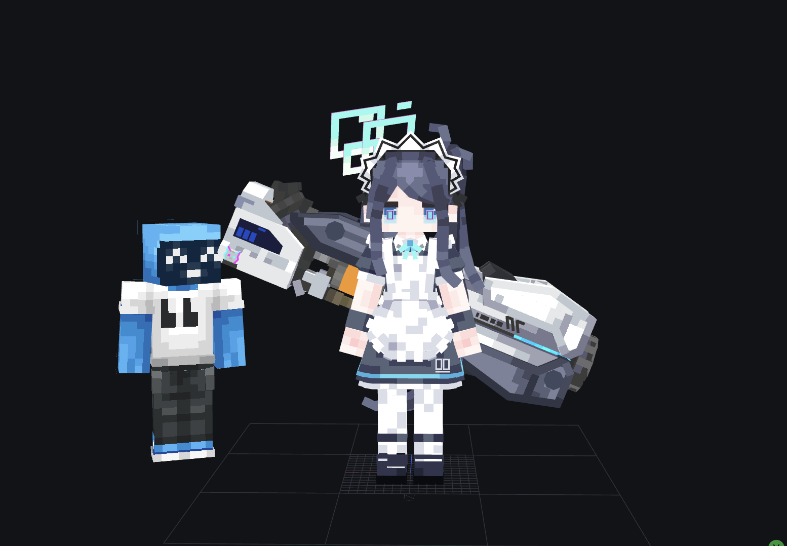
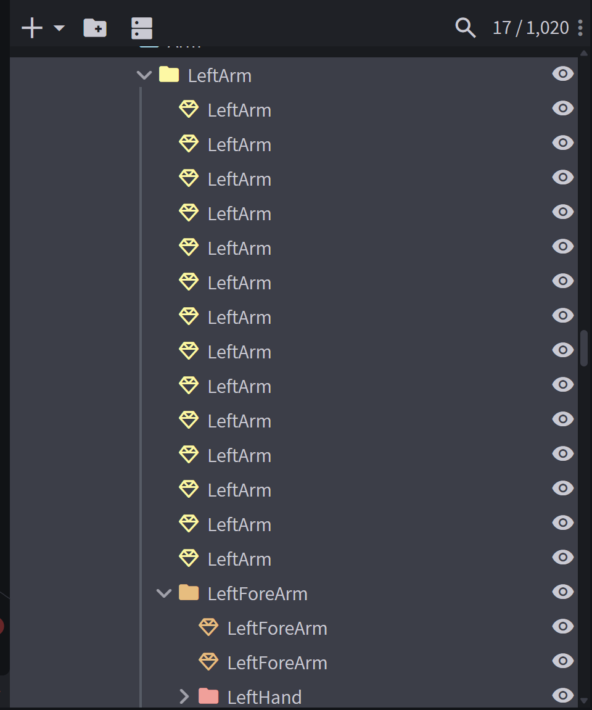
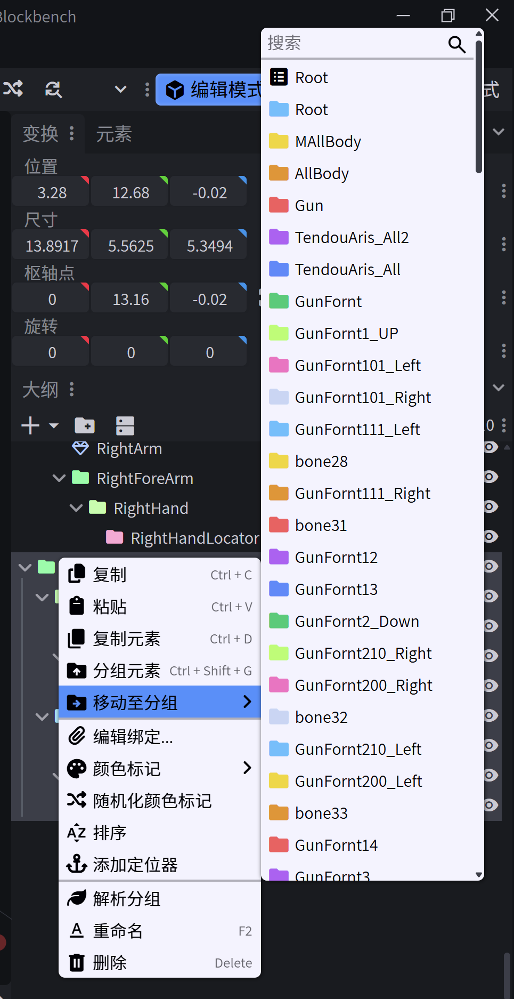
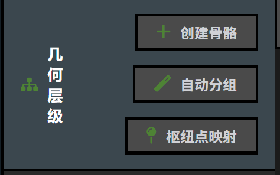
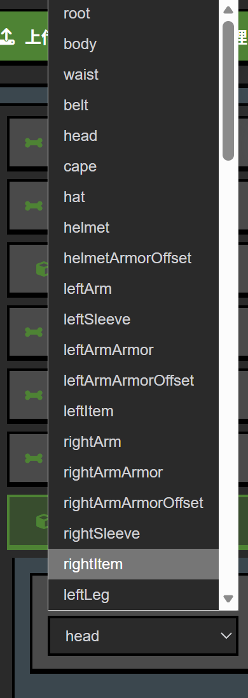

# 如何移植 YSM 模型

接下来我们来看 YSM 的移植方法。

## 准备工作

我们首先要准备好：

- **SkinStudio**：https://fangkuaichaoge.github.io/skinstudio/
- 一个 YSM 模型
- UV 优化插件

我这边选择移植难度最高的 YSM 来进行教学，这样可以一次性把所有的方法全教了。

**声明**：因学习此教程而学习任何方法都不许拿来盈利，如售卖皮肤包、收取服务费、挂网盘盈利均不允许。此教程的文件、YSM 均开源，或者是工坊、原作者团队网盘公开下载，不存在破解 YSM 文件的行为。

我们这里以「千年科学-天童爱丽丝_女仆.bbmodel」为例。

## 第一步：查看项目信息

我们打开这个文件，先查看项目信息。

首先注意到这个模型是逐面 UV 和箱型 UV 的混合模型，然后看分辨率在 128x 以上，这代表需要压缩贴图。

这种模型有 UV 区域过小的情况，初步优化会发现存在色彩缺失等情况。

## 第二步：转换 UV 模式

首先全选模型元素，长按/右键把 UV 改成逐面 UV，确保模型所有元素的 UV 被转换成逐面 UV。

接下来我们找到文件 → 导出，把文件导出为 Bedrock 版几何。

## 第三步：修复 UV

打开工具内的 [uvfixer.html](uvfixer.html)，上传刚才的 JSON 模型，执行优化，优化后下载新的 JSON 模型文件。

注意到导入的 JSON 模型会存在部分 UV 区域颜色缺失的问题，我们可以打开绘画模式，手动修复缺失的颜色 UV 区域。

## 第四步：删除无关元素

在 YSM 模型中存在基岩版 4D 不需要的元素，比如这里的扫把、表情等。

### 删除配饰

首先我们找到想要删除的无关项，然后选择其所在的 bone，然后长按/右键删除。

### 删除表情

同理，注意到表情等元素，我们也可以删除掉。

保留删改自己想要的表情与配饰。

**注**：一些模型作者会做隐藏衣服等，会给脚等建模，记得把脚趾之类的删了，不然会影响观感。我们把名字为 head 的元素隐藏，会看到开发者会在里面留有表情、嘴型等元素，我们可以选择删除、移动等让 YSM 模型的表情等元素显示出来，来自定义 4D 皮肤让它变成自己喜欢的样子。

## 第五步：优化 UV

编辑模型，找到工具一栏，找到 UV 优化插件，点击打开。

然后调节参数，确定优化效率，以确保贴图压缩到 64x64 或者是 128x128。

然后把模型项目转换成自由模型（通用模型）。

（如果你装了 Meshy 插件，可以不考虑这个步骤）

## 第六步：移植步骤

### 确定角色高度

首先长按/右键找到预览场景，找到 Minecraft player。

可以看到这个模型有点高，我们需要进行缩放操作。全选模型，找到变换 → 缩放，我这里选择 0.8，这个缩放比例刚刚好。

### 确定骨骼绑定

全选模型，右键/长按转换成网格模型，网格元素的图标为一个钻石形状的 logo。

我们把皮肤基础分为 head、body、arm、leg 这几个部分，具体情况具体分析。

#### 处理头部

我们首先找到 AllHead 这个组，这个组我们找到模型头的脖子的地方，我们把名字为 AllHead 且为脖子的 bone/元素移动到 UpperBody 这个组里面。

因为这个区域属于脖子，如果放到 head 里面，脖子会旋转，非常不合理，所以我们要把它放到 UpperBody 这个组里面。

#### 处理胳膊

我们找到胳膊的区域，这里我们找到 leftarm。

选择这个组，然后我们选择长按这些元素长按/右键，然后点击合并网格。然后我们同样对 rightarm 进行操作。找到 arm 组把 leftarm、rightarm 这两个组移动分组至 Root 组，这里是为了防止 leftarm、rightarm 这两个组的元素被合并到其他组里面。

leg 也同样进行操作。

#### 处理 Head 组

我们同样全选 Head 组的元素，点击合并网格。同样我们也需要把 Head 组的元素移动分组至 Root 组。注意，记得把脖子区域的元素移动到 UpperBody 组里面。

#### 处理 UpperBody 组

首先我们找到 DownBody 组，我们需要确定 DownBody 放到哪里。如果这个模型没有其他额外的配饰的话，就留到 AllBody 组里面，但是为了方便处理，移动到 UpperBody 组里面也可以，但是需要确保 upperbody 和 downbody 可以全部选择即可。然后我们合并网格。

好了，现在一般情况下我们就有 leftleg、rightleg、leftarm、rightarm、head、body 这几个组了。

## 第七步：导出为 OBJ 模型

找到文件 → 首选项 → 设置 → 导出，找到模型导出比例，把 16 改成 1，或者是确保导出比例为 1。

我们找到文件 → 导出 OBJ 模型。

## 第八步：使用 SkinStudio 导出

导出 OBJ 之后打开 SkinStudio，点击添加皮肤，上传 OBJ 和贴图文件。

上传好后我们找到这一栏。

我们先点击第二个「自动分组」，然后再点一下第三个「枢纽点映射」，上传 YSM 模型源文件，并把缩放比例填进去。我们这里是写了 0.8，所以我们这里也填 0.8。

然后我们点击导出包，好了，YSM 就移植好了。

## 手动绑定骨骼方法

另外一个方法就是，点击自己想要绑骨的元素，这里我们选择 head 这个元素。

head 这个元素对应的 bone 应该是 head，所以我们选择 head，然后我们点击作为 head 的 bone，然后我们把 head 的 pivot 放到脖子的地方。

### 骨骼对照表

| 骨骼名称 | 枢纽点位置 |
|---------|-----------|
| body | 模型脖子处 |
| head | 模型脖子处 |
| arm | 模型肩膀处 |
| leg | 模型大腿根处 |
| right/leftitem | 自己胳膊所在的手的地方 |

绑定好骨骼调节好枢纽点后就可以导出皮肤包了。